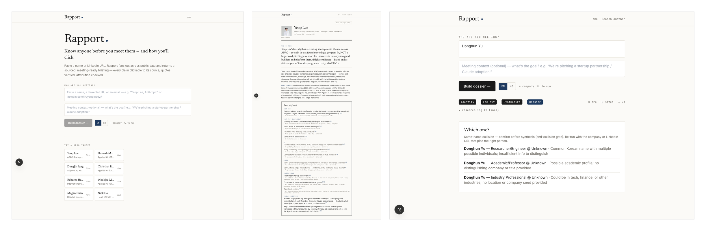
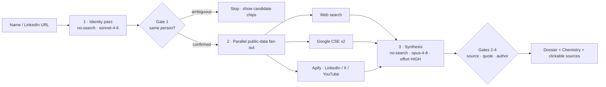
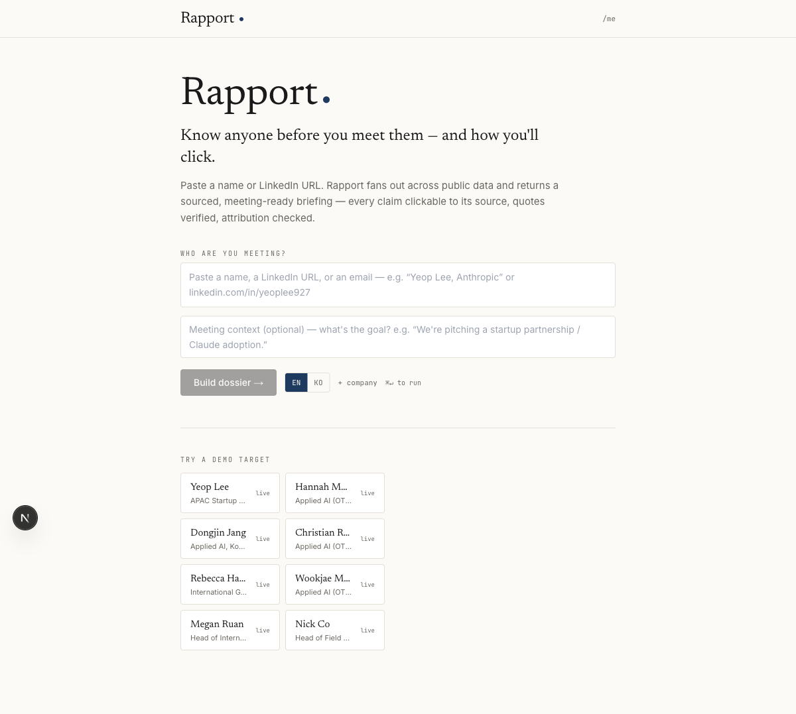
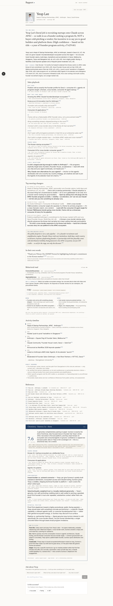
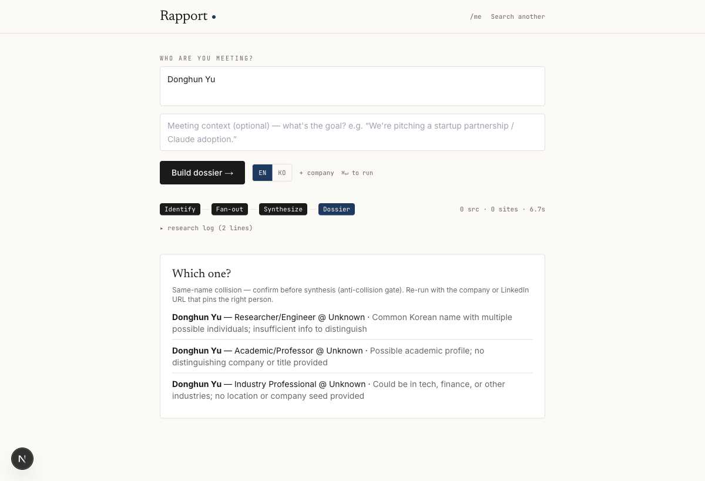

# Rapport.

### Walk into any meeting knowing exactly who you're meeting — and how you'll click.

A **source-traced person dossier** + your **chemistry** with them, in **~90 seconds**.
Every claim is clickable. Hallucination is gated out.

**▶ [Live demo](https://rapport-delta-green.vercel.app)** · **Pitch:** 3-min live walkthrough · Built in **2 hours** at **Push to Prod Seoul** (Anthropic × Replit × KIP)

---

## The problem

B2B sellers, BD, and founders walk into meetings barely knowing the person across the table. Doing it right means **30–90 minutes** of scattered googling per meeting; doing it wrong kills the conversation.

The most dangerous failure isn't *missing* info — it's confidently researching the **wrong same-name person**. Generic AI summarizes without sources, hallucinates, and never tells you it grabbed the wrong "John Kim."

## What Rapport does

Type a name or LinkedIn URL → Rapport fans out across public data and returns, in ~90 seconds:

- **The one move that wins the room** — not a bio, a play.
- **What they care about now** — verified quotes, an activity timeline.
- **Your chemistry with them** — a directional score + how to click in 5 minutes.
- **Clickable sources on every claim** — and a *"not found"* when the web is empty, never a fabrication.

You watch the AI work in a **live research log**, **ask the dossier anything** in a grounded chat (answers only from gathered sources, with citations), and mark it **correct / wrong** so it learns.

## The trust guarantee — 4 gates

The hard part isn't summarizing. It's making AI you can *walk into a meeting on*. Four gates make it trustworthy:

| # | Gate | What it kills |
|---|------|---------------|
| ① | **Disambiguation** | Same-name collisions — refuses to guess, flags it, asks you to confirm |
| ② | **Source-grounding** | Every claim must carry a source URL (or be marked inferred) |
| ③ | **Quote verification** | Each quote is substring-checked against its real source |
| ④ | **Authorship** | A topic-matching post by *someone else* is not evidence about your target |

> We pointed Rapport at this event's own judges — and it flagged two same-name traps. The public web's top "Wookjae Maeng" is a Google engineer, not the Anthropic judge; the top "Donghun Yu" is a different VC, not the KIP judge. Rapport refuses to brief the wrong person.

## How it works

A no-search **identity pass** resolves the handle → a parallel **fan-out** gathers public data → a high-effort **synthesis** writes the dossier behind the 4 gates. Cached dossiers replay instantly; cold runs take ~90s; same-name collisions are caught in ~7s.

## Screenshots

|  |  |
|---|---|
|  |  |
| **Landing** — type any name or LinkedIn URL | **Dossier** — the one move, verified quotes, every claim a clickable source |
|  | |
| **Disambiguation gate** — a common name → Rapport refuses to guess and asks you to confirm | |

## Tech stack

- **Next.js** (App Router) · **TypeScript** · **Tailwind** — single repo, white editorial design
- **Claude** is the product — `claude-opus-4-8` synthesis, `claude-sonnet-4-6` identity & chemistry
- **Anthropic web search** + **Google CSE** (dual-engine) + **Apify** (no-cookies actors for LinkedIn / X / YouTube)
- Deployed on **Vercel**; built & shipped on **Replit** + **Claude Code**

## Built at Push to Prod Seoul

Everything in this repo was written **after 2:00 PM** on 2026-06-18 (first commit timestamp on record). Pre-event prep was prompts, specs, and research only — zero code. The moat isn't *"we used AI"* — it's *"we made AI you can walk into a meeting on."*

---

Orbt · Rapport — meet anyone already knowing who they are.

